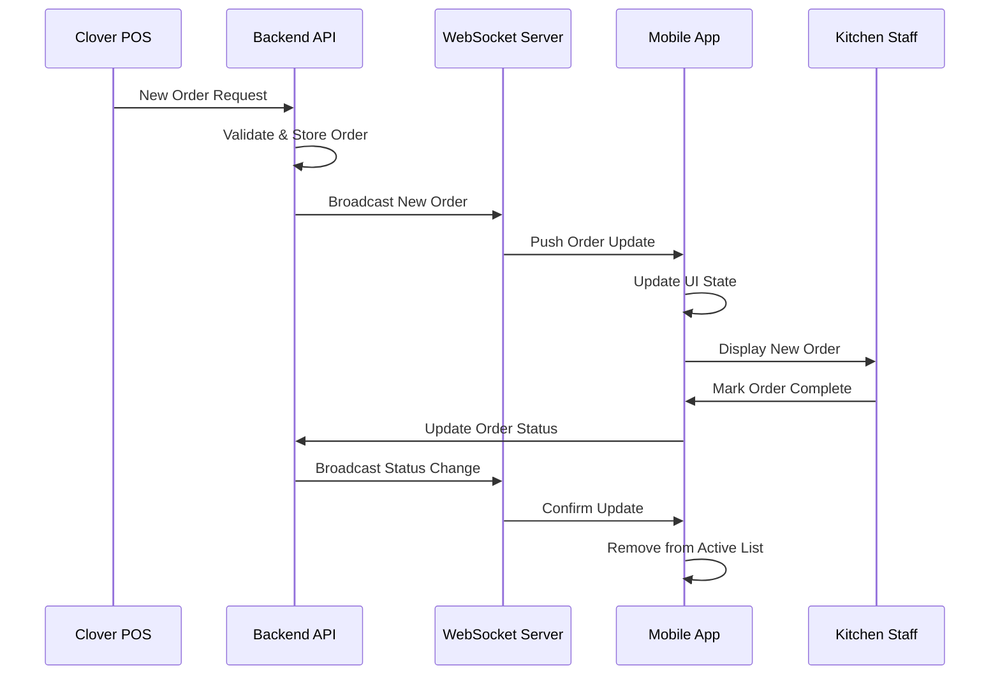
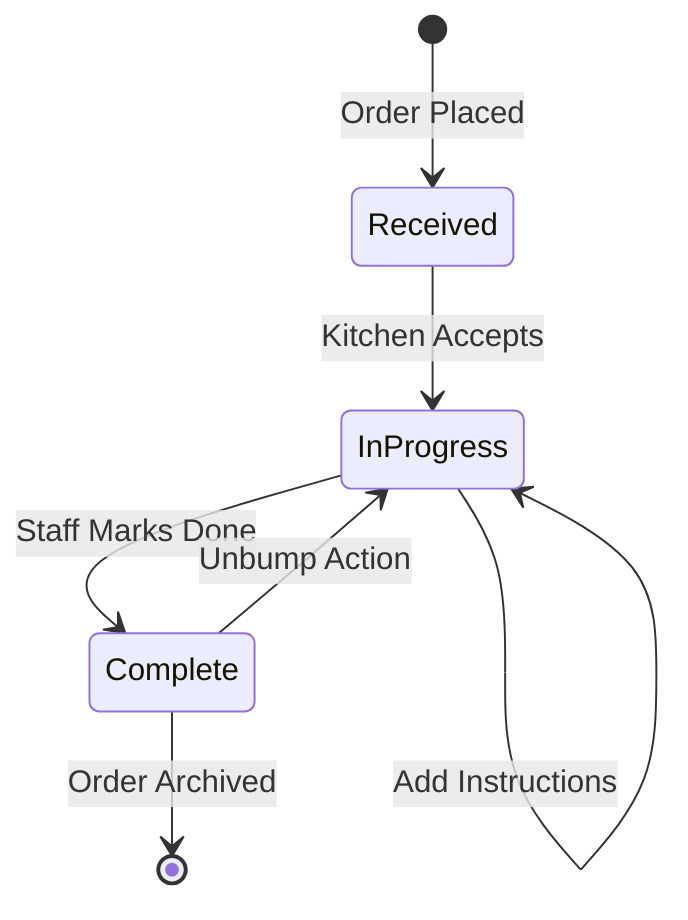

# PoppyCox Kitchen Display System - Technical Documentation

## System Architecture Overview

### High-Level Architecture

```
┌─────────────────┐    ┌─────────────────┐    ┌─────────────────┐
│   Mobile App    │    │   Backend API   │    │    Database     │
│  (React Native) │◄──►│   (Node.js)     │◄──►│   (MongoDB)     │
└─────────────────┘    └─────────────────┘    └─────────────────┘
         ▲                       ▲                       ▲
         │                       │                       │
         ▼                       ▼                       ▼
┌─────────────────┐    ┌─────────────────┐    ┌─────────────────┐
│   WebSocket     │    │  Clover POS     │    │   Analytics     │
│   Connection    │    │  Integration    │    │   Dashboard     │
└─────────────────┘    └─────────────────┘    └─────────────────┘
```

### Technology Stack

**Frontend (Mobile App)**
- **Framework**: React Native with Expo SDK 53
- **Navigation**: Expo Router 5.0.2
- **State Management**: React Hooks (useState, useEffect, useMemo)
- **Real-time Communication**: WebSocket
- **UI Components**: Custom components with StyleSheet
- **Icons**: Lucide React Native
- **Platform Support**: iOS, Android, Web

**Backend Services**
- **API Server**: Node.js with Express
- **Database**: MongoDB
- **Real-time Updates**: WebSocket Server
- **Authentication**: Firebase Authentication
- **External Integrations**: Clover POS API

**Infrastructure**
- **Hosting**: AWS (EC2, S3, RDS)
- **Monitoring**: AWS CloudWatch
- **CI/CD**: GitHub Actions

## Component Architecture

### Core Components

```
app/
├── _layout.tsx                 # Root layout with navigation
├── (tabs)/
│   ├── _layout.tsx            # Tab navigation layout
│   ├── index.tsx              # Active orders screen
│   ├── history.tsx            # Order history screen
│   └── analytics.tsx          # Analytics dashboard
└── +not-found.tsx             # 404 error page

components/
├── CloverOrderCard.tsx        # Individual order display card
├── OrderCard.tsx              # Legacy order card component
├── OrderHistoryCard.tsx       # Historical order display
├── ConnectionStatus.tsx       # WebSocket connection indicator
├── FilterModal.tsx            # Order filtering interface
└── InstructionsModal.tsx      # Special instructions popup

hooks/
├── useWebSocket.ts            # WebSocket connection management
└── useFrameworkReady.ts       # Framework initialization

types/
└── order.ts                   # TypeScript type definitions
```

### Data Flow Architecture

```
┌─────────────────┐
│   Order Source  │
│ (POS/App/Web)   │
└─────────┬───────┘
          │
          ▼
┌─────────────────┐
│  Backend API    │
│  - Validation   │
│  - Processing   │
│  - Storage      │
└─────────┬───────┘
          │
          ▼
┌─────────────────┐
│   WebSocket     │
│   Broadcast     │
└─────────┬───────┘
          │
          ▼
┌─────────────────┐
│   Mobile App    │
│  - UI Update    │
│  - State Mgmt   │
│  - User Action  │
└─────────────────┘
```

## UML Diagrams

### Class Diagram

```mermaid
classDiagram
    class Order {
        +string id
        +Date timestamp
        +OrderStatus status
        +OrderItem[] items
        +string specialInstructions
        +Priority priority
        +OrderSource source
        +OrderType orderType
        +number estimatedTime
        +string customerName
        +string tableNumber
        +string orderNumber
        +string platform
    }

    class OrderItem {
        +string id
        +string name
        +number quantity
        +string specialInstructions
        +string[] modifiers
    }

    class WebSocketHook {
        +boolean isConnected
        +string error
        +Order[] orders
        +connect() void
        +disconnect() void
        +markOrderComplete(orderId: string) void
        +unbumpOrder() void
    }

    class CloverOrderCard {
        +Order order
        +onComplete(orderId: string) void
        +onShowInstructions(order: Order) void
        +render() ReactElement
    }

    Order ||--o{ OrderItem : contains
    WebSocketHook ||--o{ Order : manages
    CloverOrderCard ||--|| Order : displays
```

### Sequence Diagram - Order Processing



### State Diagram - Order Lifecycle



## API Documentation

### REST Endpoints

```typescript
// Order Management
GET    /api/orders/active          // Get active orders
GET    /api/orders/history         // Get order history
POST   /api/orders/:id/complete    // Mark order complete
POST   /api/orders/unbump          // Revert last completed order
PUT    /api/orders/:id             // Update order details

// Analytics
GET    /api/analytics/summary      // Get performance metrics
GET    /api/analytics/trends       // Get historical trends

// Health Check
GET    /api/health                 // Service health status
```

### WebSocket Events

```typescript
// Incoming Events (Server → Client)
interface WebSocketEvents {
  'newOrder': Order;           // New order received
  'orderUpdate': Order;        // Order details changed
  'orderComplete': string;     // Order marked complete (orderId)
  'orderUnbump': Order;        // Order returned to active
  'connectionStatus': boolean; // Connection state change
}

// Outgoing Events (Client → Server)
interface ClientEvents {
  'markComplete': string;      // Mark order complete
  'unbumpOrder': void;         // Unbump last order
  'subscribe': string[];       // Subscribe to order types
}
```

## Database Schema

### MongoDB Collections

```javascript
// Orders Collection
{
  _id: ObjectId,
  id: String,                    // External order ID
  orderNumber: String,           // Display order number
  timestamp: Date,               // Order creation time
  status: String,                // 'In Progress' | 'Complete'
  orderType: String,             // 'Pickup' | 'Delivery' | 'Dine In' | 'Curbside' | 'Table'
  items: [{
    id: String,
    name: String,
    quantity: Number,
    specialInstructions: String,
    modifiers: [String]
  }],
  specialInstructions: String,
  priority: String,              // 'High' | 'Normal' | 'Low'
  source: String,                // 'Clover POS' | 'Mobile App' | 'Website'
  platform: String,             // 'Grubhub' | 'Clover online' | 'In-store'
  estimatedTime: Number,         // Minutes
  customerName: String,
  tableNumber: String,
  createdAt: Date,
  updatedAt: Date
}

// Analytics Collection
{
  _id: ObjectId,
  date: Date,
  totalOrders: Number,
  completedOrders: Number,
  avgFulfillmentTime: Number,
  ordersByType: {
    pickup: Number,
    delivery: Number,
    dineIn: Number,
    curbside: Number,
    table: Number
  },
  ordersBySource: {
    cloverPOS: Number,
    mobileApp: Number,
    website: Number
  }
}
```

## Performance Specifications

### Response Time Requirements
- **Order Display**: < 1 second from receipt
- **Status Updates**: < 500ms
- **History Loading**: < 2 seconds
- **Analytics Refresh**: < 3 seconds

### Scalability Targets
- **Concurrent Users**: 1,000+
- **Orders per Hour**: 100+ per location
- **Database Queries**: < 100ms average
- **WebSocket Connections**: 500+ simultaneous

### Reliability Metrics
- **Uptime**: 99.9% (< 1 hour downtime/month)
- **Error Rate**: < 0.1%
- **Data Loss**: 0% tolerance
- **Recovery Time**: < 5 minutes

## Security Architecture

### Authentication & Authorization
```typescript
interface UserRole {
  role: 'kitchen_staff' | 'manager' | 'admin';
  permissions: Permission[];
  locationAccess: string[];
}

interface Permission {
  resource: 'orders' | 'analytics' | 'settings';
  actions: ('read' | 'write' | 'delete')[];
}
```

### Data Protection
- **Encryption**: TLS 1.3 for all communications
- **API Security**: JWT tokens with 24-hour expiration
- **Database**: Encrypted at rest (AES-256)
- **PII Handling**: Customer data anonymization after 90 days

## Deployment Architecture

### Environment Configuration
```yaml
# Production Environment
production:
  api_url: "https://api.poppycox-kds.com"
  websocket_url: "wss://ws.poppycox-kds.com"
  database_url: "mongodb://prod-cluster.mongodb.net"
  redis_url: "redis://prod-cache.redis.com"

# Staging Environment  
staging:
  api_url: "https://staging-api.poppycox-kds.com"
  websocket_url: "wss://staging-ws.poppycox-kds.com"
  database_url: "mongodb://staging-cluster.mongodb.net"
  redis_url: "redis://staging-cache.redis.com"
```

### CI/CD Pipeline
```yaml
# GitHub Actions Workflow
name: Deploy KDS App
on:
  push:
    branches: [main]

jobs:
  test:
    runs-on: ubuntu-latest
    steps:
      - name: Run Tests
        run: npm test
      - name: Type Check
        run: npm run type-check
      - name: Lint
        run: npm run lint

  build:
    needs: test
    runs-on: ubuntu-latest
    steps:
      - name: Build App
        run: expo build:web
      - name: Deploy to AWS
        run: aws s3 sync dist/ s3://kds-app-bucket
```

## Monitoring & Observability

### Key Metrics
- **Application Performance**: Response times, error rates
- **Business Metrics**: Orders processed, completion rates
- **Infrastructure**: CPU, memory, network usage
- **User Experience**: App crashes, load times

### Alerting Rules
```yaml
alerts:
  - name: High Error Rate
    condition: error_rate > 5%
    duration: 5m
    severity: critical
    
  - name: Slow Response Time
    condition: avg_response_time > 2s
    duration: 10m
    severity: warning
    
  - name: WebSocket Disconnections
    condition: disconnection_rate > 10%
    duration: 2m
    severity: critical
```

## Testing Strategy

### Test Pyramid
```
    ┌─────────────────┐
    │   E2E Tests     │  ← 10% (Critical user flows)
    │                 │
    ├─────────────────┤
    │ Integration     │  ← 20% (API + Database)
    │ Tests           │
    ├─────────────────┤
    │   Unit Tests    │  ← 70% (Components + Logic)
    │                 │
    └─────────────────┘
```

### Test Coverage Requirements
- **Unit Tests**: > 80% code coverage
- **Integration Tests**: All API endpoints
- **E2E Tests**: Critical user journeys
- **Performance Tests**: Load testing for peak usage

This technical documentation provides a comprehensive overview of the PoppyCox Kitchen Display System architecture, including UML diagrams, API specifications, database schemas, and deployment strategies. The system is designed for high availability, scalability, and maintainability in a production restaurant environment.